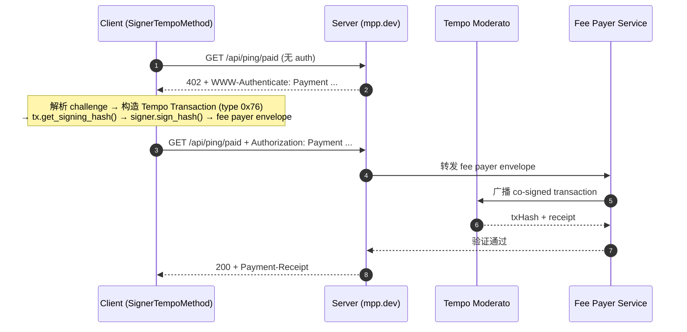
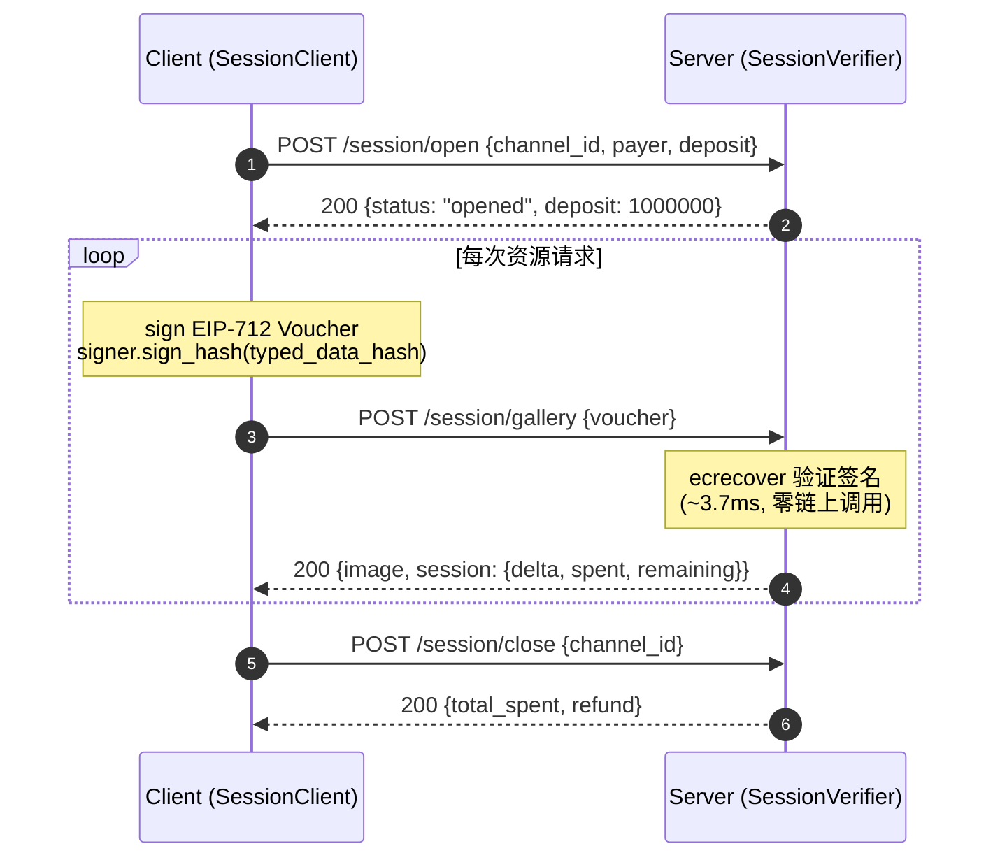

# MPP Python Demo — E2E 详细过程报告

- **运行时间**：2026-03-27T01:07:00Z
- **平台**：Ubuntu 24.04 LTS, Python 3.14.3
- **pympp**: 0.4.2 | **pytempo**: 0.4.0
- **链**：Tempo Moderato Testnet (chain ID 42431)
- **Token**: pathUSD (`0x20c0000000000000000000000000000000000000`, decimals=6)
- **Escrow 合约**: `0xe1c4d3dce17bc111181ddf716f75bae49e61a336`

---

## 测试账户

| 字段 | 值 |
|------|------|
| Address | `0x76BFc4B290823a08c6402fBC444A8E99B57d8a3D` |
| Funded via | `tempo_fundAddress` RPC faucet |
| Signer 类型 | `LocalSigner`（async `sign_hash`，非 pympp 内部签名） |
| 签名方式 | `SignerTempoMethod` → `tx.get_signing_hash()` → `signer.sign_hash()` |

---

## E2E 1: Charge — 官方 mpp.dev/api/ping/paid

端到端耗时：**1492 ms**（首跳 240ms + 二跳 1252ms）

### 1.1 时序图



### 1.2 首跳：获取 Challenge

- **Method**: `GET`
- **URL**: `https://mpp.dev/api/ping/paid`
- **响应状态**: `402 Payment Required`
- **耗时**: 240 ms

**关键 Headers**:
```
HTTP/2 402
cache-control: no-store
content-type: application/problem+json
www-authenticate: Payment id="UxRgaZMOqu7cHDiPYm1WjwbJ6Cu_iMhRlXWX5HNgc04",
  realm="mpp.sh", method="tempo", intent="charge",
  request="eyJhbW91bnQiOiIxMDAwMDAi...", description="Ping endpoint access",
  expires="2026-03-27T01:12:06.748Z"
```

**Body (RFC 9457 Problem Details)**:
```json
{
  "type": "https://paymentauth.org/problems/payment-required",
  "title": "Payment Required",
  "status": 402,
  "detail": "Payment is required (Ping endpoint access).",
  "challengeId": "UxRgaZMOqu7cHDiPYm1WjwbJ6Cu_iMhRlXWX5HNgc04"
}
```

**Challenge `request` 解码**（base64url → JSON）:
```json
{
  "amount": "100000",
  "currency": "0x20c0000000000000000000000000000000000000",
  "methodDetails": {
    "chainId": 42431,
    "feePayer": true
  },
  "recipient": "0xf39Fd6e51aad88F6F4ce6aB8827279cffFb92266"
}
```

**关键字段解释**:
- `id`: HMAC-SHA256 challenge ID（服务端可无状态验证）
- `realm`: `mpp.sh` — 服务端标识
- `method`: `tempo` — 使用 Tempo 支付方式
- `intent`: `charge` — 一次性支付
- `request.amount`: `100000` = 0.10 pathUSD（6 decimals）
- `request.currency`: pathUSD 合约地址
- `request.methodDetails.chainId`: `42431` — Tempo Moderato Testnet
- `request.methodDetails.feePayer`: `true` — 服务端赞助 gas
- `request.recipient`: Tempo 官方收款地址
- `expires`: 5 分钟有效期

### 1.3 从 Challenge 构造待签名交易

`SignerTempoMethod._build_with_signer()` 执行以下步骤：

**Step 1: 获取链上参数**（RPC: `https://rpc.moderato.tempo.xyz`）
- `eth_chainId` → `42431`
- `eth_getTransactionCount(address)` → 当前 nonce
- `eth_gasPrice` → 当前 gas price

**Step 2: 构造 TIP-20 transferWithMemo calldata**
```
Selector: 0x95777d59 = keccak256("transferWithMemo(address,uint256,bytes32)")[:4]
Parameters:
  to:     0xf39Fd6e51aad88F6F4ce6aB8827279cffFb92266 (recipient, padded to 32 bytes)
  amount: 100000 (padded to 32 bytes)
  memo:   attribution bytes32 (server_id + client_id hash)
```

**Step 3: 构造 TempoTransaction (type 0x76)**
```python
tx = TempoTransaction.create(
    chain_id=42431,
    gas_limit=1000000,          # DEFAULT_GAS_LIMIT (AA tx intrinsic gas 较高)
    max_fee_per_gas=gas_price,
    max_priority_fee_per_gas=gas_price,
    nonce=0,                     # expiring nonce (因为 feePayer=true)
    nonce_key=2**256 - 1,        # U256::MAX = expiring nonce key
    fee_token=None,              # feePayer 模式下由服务端设定
    awaiting_fee_payer=True,
    valid_before=now + 25,       # 25 秒有效窗口
    calls=(Call(to=pathUSD, value=0, data=transfer_calldata),),
)
```

**Step 4: 获取 signing hash**
```python
signing_hash = tx.get_signing_hash(for_fee_payer=False)
# = keccak256(0x76 || RLP([chainId, maxPriorityFee, maxFee, gasLimit,
#   calls, accessList, nonceKey, nonce, validBefore, validAfter,
#   b"" (feePayer placeholder), 0x00, tempoAuthList]))
```
→ 32-byte hash

**Step 5: Signer 签名** ⭐
```python
sig_bytes = await signer.sign_hash(signing_hash)  # LocalSigner.sign_hash()
# 内部: Account.unsafe_sign_hash(hash) → 65 bytes (r || s || v)
```

**Step 6: 构造 fee payer envelope**
```python
sig = Signature.from_bytes(sig_bytes)
signed_tx = attrs.evolve(tx, sender_signature=sig, sender_address=signer.address)
envelope = encode_fee_payer_envelope(signed_tx)
# → 0x78 prefix + RLP([tx_fields, sender_address, sender_signature])
```

### 1.4 二跳：提交 Credential

pympp `Client` 自动将 fee payer envelope 封装为 `Credential`：

```python
Credential(
    challenge=challenge.to_echo(),  # 回显 challenge 参数
    payload={
        "type": "transaction",
        "signature": "0x78..." # fee payer envelope hex
    },
    source="did:pkh:eip155:42431:0x76BFc4B290823a08c6402fBC444A8E99B57d8a3D"
)
```

序列化为 `Authorization: Payment ...` header，重试 `GET /api/ping/paid`。

**服务端处理流程**:
1. 解析 `Authorization` header → `Credential`
2. 验证 challenge echo 的 HMAC（无状态验证 challenge 完整性）
3. 解码 fee payer envelope → 恢复 sender 地址（ecrecover）
4. 设定 fee_token → co-sign as fee payer → 广播到 Tempo Moderato
5. 等待 receipt → 验证 Transfer log

### 1.5 结算结果

- **响应状态**: `200`
- **耗时**: 1252 ms（含链上确认）
- **Body**: `tm! thanks for paying`

**Payment-Receipt 解码**:
```json
{
  "method": "tempo",
  "status": "success",
  "timestamp": "2026-03-27T01:07:41.812Z",
  "reference": "0xdc15c1fcad6b603e80c40c0eacfe253d93233b746c345902df2a03f6a17a04c8"
}
```

**链上核验**:
- Tx: `0xdc15c1...a04c8`
- Explorer: https://explore.testnet.tempo.xyz/tx/0xdc15c1fcad6b603e80c40c0eacfe253d93233b746c345902df2a03f6a17a04c8
- 实际转账: 0.10 pathUSD from `0x76BFc4B2...` → `0xf39Fd6e5...`

---

## E2E 2: Charge — 本地 Server /joke

端到端耗时：**1230 ms**

### 流程概要

与 E2E 1 相同的 402 → sign → submit → verify 流程，但不使用 feePayer（Client 自付 gas）。

### 首跳 Challenge

```
WWW-Authenticate: Payment id="...", realm="localhost", method="tempo",
  intent="charge", request="...", description="One programmer joke ($0.01)",
  expires="2026-03-27T01:12:42.123Z"
```

**request 解码**:
```json
{
  "amount": "10000",
  "currency": "0x20c0000000000000000000000000000000000000",
  "methodDetails": { "chainId": 42431 },
  "recipient": "0x76BFc4B290823a08c6402fBC444A8E99B57d8a3D"
}
```

- `amount`: `10000` = 0.01 pathUSD
- 无 `feePayer` → Client 自付 gas → 使用正常 nonce（非 expiring）
- `fee_token` 设为 pathUSD（用稳定币付 gas）

### 签名差异（vs E2E 1）

| 维度 | E2E 1 (mpp.dev) | E2E 2 (local) |
|------|-----------------|---------------|
| feePayer | `true` (服务端赞助 gas) | `false` (Client 自付) |
| nonce_key | `2^256 - 1` (expiring) | `0` (normal sequential) |
| nonce | `0` | 链上实际 nonce |
| fee_token | `None` (server 设定) | pathUSD |
| 输出格式 | fee payer envelope (0x78) | signed tx (0x76) |

### 结算结果

```
HTTP 200 (1230ms)
Joke: A SQL query walks into a bar, sees two tables, and asks: 'Can I JOIN you?'
Payer: did:pkh:eip155:42431:0x76BFc4B290823a08c6402fBC444A8E99B57d8a3D
```

**Receipt**: txHash = `0x60272055b6c9ae3b173e4e3c6479e3cc6f769fd13cd6c04fe0976a09a...`

---

## E2E 3: Session — 本地 Server（Off-chain Voucher）

端到端耗时：**23 ms**（open 6ms + 3 vouchers 16ms + close 1ms）
链上交易数：**0**

### 3.1 时序图



### 3.2 Step 1: 开通 Payment Channel

- **Method**: `POST /session/open`
- **耗时**: 6 ms
- **Body**:
```json
{
  "channel_id": "0xfc323d223b1342269b2d40c1d1809177d7cd4da1c32a4a468cb9bc0aa0f229fa",
  "payer": "0x76BFc4B290823a08c6402fBC444A8E99B57d8a3D",
  "deposit": 1000000
}
```
- **Response**:
```json
{
  "status": "opened",
  "channel_id": "0xfc323d223b1342269b2d40c1d1809177d7cd4da1c32a4a468cb9bc0aa0f229fa",
  "payer": "0x76BFc4B290823a08c6402fBC444A8E99B57d8a3D",
  "deposit": 1000000,
  "price_per_image": 5000
}
```

**说明**：`deposit = 1000000` = $1.00 pathUSD。实际生产中这一步对应链上 escrow 合约存款，demo 中为内存模拟。

### 3.3 Step 2: 签名 EIP-712 Voucher

**EIP-712 Domain**:
```json
{
  "name": "MPP Session",
  "version": "1",
  "chainId": 42431,
  "verifyingContract": "0xe1c4d3dce17bc111181ddf716f75bae49e61a336"
}
```

**EIP-712 Types**:
```json
{
  "Voucher": [
    { "name": "channelId", "type": "bytes32" },
    { "name": "cumulativeAmount", "type": "uint256" },
    { "name": "nonce", "type": "uint256" }
  ]
}
```

**Voucher #1 Message**:
```json
{
  "channelId": "0xfc323d223b1342269b2d40c1d1809177d7cd4da1c32a4a468cb9bc0aa0f229fa",
  "cumulativeAmount": 5000,
  "nonce": 1
}
```

**签名流程**:
```python
signable = encode_typed_data(full_message=full_message)
# signable.body = keccak256(0x1901 || domainSeparator || structHash)
#   domainSeparator = keccak256(EIP712Domain type hash || name || version || chainId || verifyingContract)
#   structHash = keccak256(Voucher type hash || channelId || cumulativeAmount || nonce)

sig_bytes = await signer.sign_hash(signable.body)
# → 65 bytes: r(32) + s(32) + v(1)
```

**签名结果**: `0x1018195313ca6776ccf5f20dd06cd74c451dba15...abfb3f1c`

### 3.4 Step 3: 提交 Voucher，Server ecrecover 验证

- **Method**: `POST /session/gallery`
- **耗时**: 6 ms（含 ecrecover 验证 ~3.7ms）
- **Body**:
```json
{
  "channel_id": "0xfc323d22...",
  "cumulative_amount": 5000,
  "nonce": 1,
  "signature": "0x1018195313ca6776...",
  "signer": "0x76BFc4B290823a08c6402fBC444A8E99B57d8a3D"
}
```

**Server 验证流程**:
1. 检查 `channel_id` 存在 → ✅
2. 检查 `nonce > last_nonce` (1 > 0) → ✅
3. 检查 `cumulative_amount > cumulative_verified` (5000 > 0) → ✅
4. 检查 `cumulative_amount <= deposit` (5000 ≤ 1000000) → ✅
5. 重建 EIP-712 typed data → `encode_typed_data()` → `signable.body`
6. `Account._recover_hash(signable.body, signature)` → 恢复签名者地址
7. 比较恢复地址与 `channel.payer` → ✅ match

**Response**:
```json
{
  "image": { "id": 2, "url": "https://picsum.photos/400/300?random=2", "title": "Ocean Breeze" },
  "payer": "0x76BFc4B290823a08c6402fBC444A8E99B57d8a3D",
  "session": {
    "channel_id": "0xfc323d22...",
    "delta": 5000,
    "cumulative_spent": 5000,
    "remaining": 995000
  }
}
```

### 3.5 Step 4-5: Voucher #2, #3

| Voucher | cumulativeAmount | nonce | 耗时 | remaining |
|---------|-----------------|-------|------|-----------|
| #1 | 5000 ($0.005) | 1 | 6 ms | $0.9950 |
| #2 | 10000 ($0.010) | 2 | 5 ms | $0.9900 |
| #3 | 15000 ($0.015) | 3 | 5 ms | $0.9850 |

每个 voucher 的签名对象只变 `cumulativeAmount` 和 `nonce`（递增），`channelId` 不变。

### 3.6 Step 6: 关闭 Channel

- **Method**: `POST /session/close`
- **耗时**: 1 ms
- **Response**:
```json
{
  "status": "closed",
  "channel_id": "0xfc323d223b1342269b2d40c1d1809177d7cd4da1c32a4a468cb9bc0aa0f229fa",
  "total_spent": 15000,
  "refund": 985000,
  "payer": "0x76BFc4B290823a08c6402fBC444A8E99B57d8a3D"
}
```

- `total_spent`: 15000 = $0.015（3 张图 × $0.005）
- `refund`: 985000 = $0.985（$1.000 - $0.015）
- 实际生产中 close 会调用 escrow 合约的 `close()` 方法，提交最高累积 voucher 链上结算

---

## 性能对比

| 维度 | Charge (E2E 1/2) | Session (E2E 3) |
|------|-------------------|-----------------|
| 单次请求延迟 | ~1200-1500 ms | **5-6 ms** |
| 链上交易 | 每次 1 笔 | **0 笔**（close 时批量 1 笔） |
| Gas 成本 | 每次 ~270K gas | **0**（close 时 1 笔） |
| 签名对象 | TempoTransaction (type 0x76) | EIP-712 Voucher |
| 验证方式 | 链上 receipt + Transfer log | ecrecover（CPU-bound） |
| 适用场景 | 单次购买 | 高频 API 计费、per-token LLM |

### Benchmark (100 vouchers)
```
Sign:   2.5 ms/voucher
Verify: 3.7 ms/voucher
Total:  6.2 ms/round-trip

→ Session 比 Charge 快 ~200-250x
```

---

## 安全属性

| 属性 | Charge | Session |
|------|--------|---------|
| 防重放 | challenge nonce + HMAC | 递增 nonce + 累积金额 |
| 身份验证 | 链上 from 地址 | ecrecover |
| 金额上限 | 单次 challenge 金额 | deposit 上限 |
| 时间限制 | challenge expires (5min) | channel 生命周期 |
| 签名绑定 | EIP-712 domain (chain + contract) | EIP-712 domain (chain + escrow contract) |
| 密钥隔离 | Signer ABC → sign_hash() | 同一 Signer ABC |

---

## 执行环境

| 组件 | 版本/配置 |
|------|----------|
| Python | 3.14.3 |
| pympp | 0.4.2 |
| pytempo | 0.4.0 |
| FastAPI | 0.135.2 |
| eth-account | 0.13+ |
| Chain | Tempo Moderato Testnet (42431) |
| Token | pathUSD (0x20c0..., 6 decimals) |
| Escrow | 0xe1c4d3dce17bc111181ddf716f75bae49e61a336 |
| RPC | https://rpc.moderato.tempo.xyz |
| Official server | mpp.dev (Vercel) |
| Local server | FastAPI + uvicorn (127.0.0.1:8780) |
