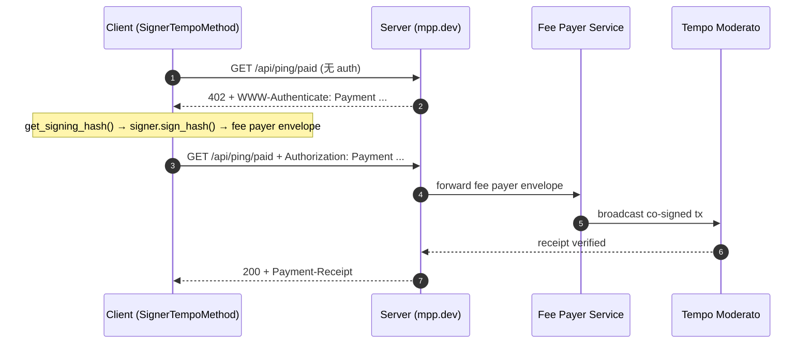
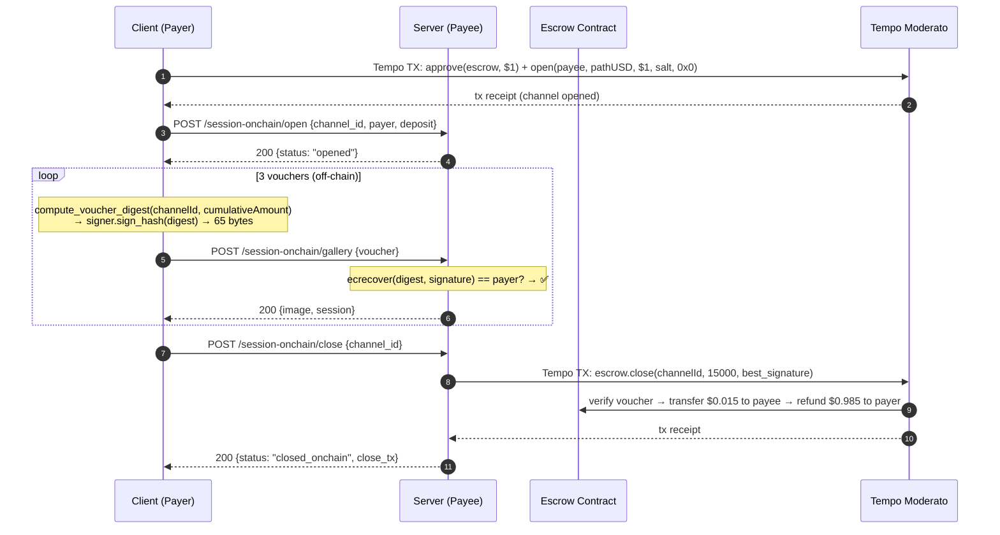

# MPP Python Demo — E2E 详细过程报告

- **运行时间**：2026-03-27
- **平台**：Ubuntu 24.04 LTS, Python 3.14.3
- **pympp**: 0.4.2 | **pytempo**: 0.4.0
- **链**：Tempo Moderato Testnet (chain ID 42431)
- **Token**: pathUSD (`0x20c0000000000000000000000000000000000000`, decimals=6)
- **Escrow 合约**: `0xe1c4d3dce17bc111181ddf716f75bae49e61a336`

---

## 测试账户

| 角色 | Address | 用途 |
|------|---------|------|
| Payer (Client) | `0x76BFc4B290823a08c6402fBC444A8E99B57d8a3D` | 付款方，签 voucher |
| Payee (Server) | `0x5d8D22169d5759E7edDF32898138368D7dfd7d9f` | 收款方，链上 close |
| Funded via | `tempo_fundAddress` RPC faucet | pathUSD |

---

## E2E 1: Charge — 官方 mpp.dev/api/ping/paid

端到端耗时：**1492 ms**

### 时序图



### Step 1: 402 Challenge

**Request**: `GET https://mpp.dev/api/ping/paid`
**Response**: `402 Payment Required` (240ms)

```
WWW-Authenticate: Payment id="UxRga...", realm="mpp.sh", method="tempo",
  intent="charge", request="eyJh...", expires="2026-03-27T01:12:06.748Z"
```

**Challenge request 解码**:
```json
{
  "amount": "100000",
  "currency": "0x20c0000000000000000000000000000000000000",
  "methodDetails": { "chainId": 42431, "feePayer": true },
  "recipient": "0xf39Fd6e51aad88F6F4ce6aB8827279cffFb92266"
}
```

- `amount`: 100000 = **$0.10 pathUSD**
- `feePayer: true` — 服务端赞助 gas

### Step 2-4: 签名 → 提交 → 验证

**SignerTempoMethod 签名流程**:
1. `get_tx_params()` → chain_id=42431, nonce, gas_price
2. 构造 `TempoTransaction(type=0x76)` + TIP-20 `transferWithMemo` calldata
3. `tx.get_signing_hash(for_fee_payer=False)` → 32-byte digest
4. `signer.sign_hash(digest)` → 65-byte signature ⭐
5. `attrs.evolve(tx, sender_signature=sig)` → fee payer envelope (0x78)

### Step 5: 200 + Receipt

```
Body: tm! thanks for paying
Receipt: {
  "method": "tempo", "status": "success",
  "reference": "0xdc15c1fcad6b603e80c40c0eacfe253d93233b746c345902df2a03f6a17a04c8"
}
```

---

## E2E 2: Charge — 本地 Server /joke

端到端耗时：**1230 ms** | 无 feePayer（Client 自付 gas）

**签名差异**:
| 维度 | E2E 1 (mpp.dev) | E2E 2 (local) |
|------|-----------------|---------------|
| feePayer | true | false |
| nonce_key | 2^256-1 (expiring) | 0 (sequential) |
| fee_token | None (server 设定) | pathUSD |
| 输出格式 | 0x78 envelope | 0x76 signed tx |

**结果**: `HTTP 200` → joke + receipt

---

## E2E 3: Session (Off-chain) — 本地 Server

端到端耗时：**23 ms** | 链上交易：**0 笔**

Voucher 签名使用 `compute_voucher_digest()`（手动计算，与合约 `getVoucherDigest()` 输出完全一致）。

### 流程

1. `POST /session/open` (6ms) → 开通 channel（内存模拟 deposit $1.00）
2. 3× `POST /session/gallery` (5-6ms each) → sign voucher → ecrecover → 返回图片
3. `POST /session/close` (1ms) → 结算

每个 voucher 验证只需 ecrecover（~3.7ms CPU），零链上调用。

---

## E2E 4: Session (On-chain) — 真实 TempoStreamChannel Escrow ⭐

端到端耗时：**~8s** (open 2.8s + 3 vouchers ~18ms + close 2.7s)
链上交易：**2 笔**（open + close）

### 时序图



### Step 1: 链上 Open (approve + open batched)

**Tempo Transaction** (type 0x76, 2 calls batched):
```
Call 1: pathUSD.approve(escrow, 1000000)
  to:   0x20c0000000000000000000000000000000000000
  data: 0x095ea7b3 + escrow_padded + amount_padded

Call 2: escrow.open(payee, pathUSD, 1000000, salt, 0x0)
  to:   0xe1c4d3dce17bc111181ddf716f75bae49e61a336
  data: 0xc79ea485 + payee + token + deposit + salt + authorizedSigner
```

**签名**: `tx.get_signing_hash() → signer.sign_hash() → Signature → evolve`
**结果**: TX `0xd9e089743cf98551...` | Channel: `0x3f9b500e6d0ee2b0...`
**耗时**: ~2800ms
**Explorer**: https://explore.testnet.tempo.xyz/tx/0xd9e089743cf98551ce4559c12a8ae3e3a26ef92c31403f4d82f74eba95536b2f

### Step 2: Server 注册 Channel

`POST /session-onchain/open` → Server 记录 channel_id/payer/deposit

### Step 3: Off-chain Voucher 签名 (×3)

**EIP-712 Domain** (与合约 `domainSeparator()` 输出完全一致):
```json
{
  "name": "Tempo Stream Channel",
  "version": "1",
  "chainId": 42431,
  "verifyingContract": "0xe1c4d3dce17bc111181ddf716f75bae49e61a336"
}
```

**Voucher TYPEHASH** (与合约 `VOUCHER_TYPEHASH` 完全一致):
```
keccak256("Voucher(bytes32 channelId,uint128 cumulativeAmount)")
= 0xe97c93f01d3ef8eaba1586553df13308f236815bf4ea49c7b696895d8f5ea68a
```

**Digest 计算** (`compute_voucher_digest()`):
```python
struct_hash = keccak256(abi.encode(VOUCHER_TYPEHASH, channelId, cumulativeAmount))
digest = keccak256(0x1901 || DOMAIN_SEPARATOR || struct_hash)
```

**已验证**: `compute_voucher_digest()` 输出 = 合约 `getVoucherDigest()` 输出 ✅

| Voucher | cumulativeAmount | 耗时 | Signature |
|---------|-----------------|------|-----------|
| #1 | 5000 ($0.005) | 6ms | `0x47b5af...4c747d1c` |
| #2 | 10000 ($0.010) | 5ms | `0xe8f6ea...8076231c` |
| #3 | 15000 ($0.015) | 6ms | `0x3f00b8...3e85f71c` |

**Server 验证**: ecrecover(digest, sig) == payer address → ✅

### Step 4: 链上 Close

Server 提交 **最高累积 voucher** (`cumulativeAmount=15000`, `signature=best_signature`) 给 escrow 合约。

**Tempo Transaction**:
```
escrow.close(channelId, 15000, signature)
  → verify voucher (contract-side ecrecover)
  → transfer 15000 ($0.015) pathUSD to payee
  → refund 985000 ($0.985) pathUSD to payer
```

**结果**:
```json
{
  "status": "closed_onchain",
  "total_spent": 15000,
  "refund": 985000,
  "close_tx": "0x4cf4d02b57b5b1b799a7cb75a1a4da7e67bfa734b2b56160e319ddd1d55b94e2"
}
```

**Explorer**: https://explore.testnet.tempo.xyz/tx/0x4cf4d02b57b5b1b799a7cb75a1a4da7e67bfa734b2b56160e319ddd1d55b94e2

---

## 性能对比

| 维度 | Charge (E2E 1/2) | Session Off-chain (E2E 3) | Session On-chain (E2E 4) |
|------|-------------------|---------------------------|--------------------------|
| 单次请求延迟 | ~1200-1500 ms | **5-6 ms** | **5-6 ms** (voucher) |
| 链上交易 | 每次 1 笔 | **0 笔** | **2 笔** (open + close) |
| 总耗时 (3 requests) | ~4.5s | **23ms** | **~8s** (含 open/close) |
| 验证方式 | 链上 receipt | ecrecover | ecrecover + 链上 settle |
| 适用场景 | 单次购买 | 高频 API (demo) | 高频 API (production) |

---

## 安全属性

| 属性 | Charge | Session (Off/On-chain) |
|------|--------|------------------------|
| 防重放 | challenge HMAC + nonce | 累积金额递增 + app nonce |
| 身份验证 | 链上 from 地址 | ecrecover = payer |
| 金额上限 | 单次 challenge 金额 | escrow deposit |
| 时间限制 | challenge expires 5min | channel 生命周期 + close grace |
| 签名绑定 | EIP-712 (Tempo tx hash) | EIP-712 (escrow domainSeparator) |
| 链上结算 | 每次 | close 时批量 |
| 密钥隔离 | Signer.sign_hash() | 同一 Signer.sign_hash() |

---

## 执行环境

| 组件 | 版本/配置 |
|------|----------|
| Python | 3.14.3 |
| pympp | 0.4.2 |
| pytempo | 0.4.0 |
| FastAPI | 0.135.2 |
| eth-account | 0.13+ |
| eth-abi | 5.0+ |
| Chain | Tempo Moderato Testnet (42431) |
| Token | pathUSD (0x20c0..., 6 decimals) |
| Escrow | 0xe1c4d3dce17bc111181ddf716f75bae49e61a336 |
| RPC | https://rpc.moderato.tempo.xyz |
| Official server | mpp.dev (Vercel) |
| Local server | FastAPI + uvicorn (127.0.0.1) |
| Unit tests | 56 passed |
