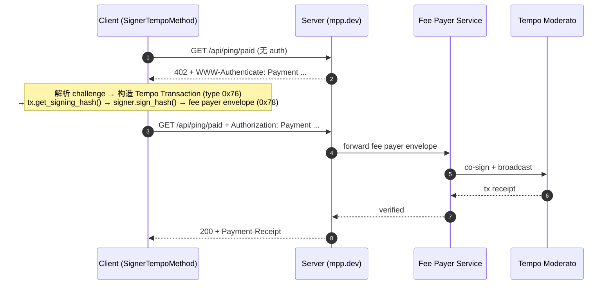
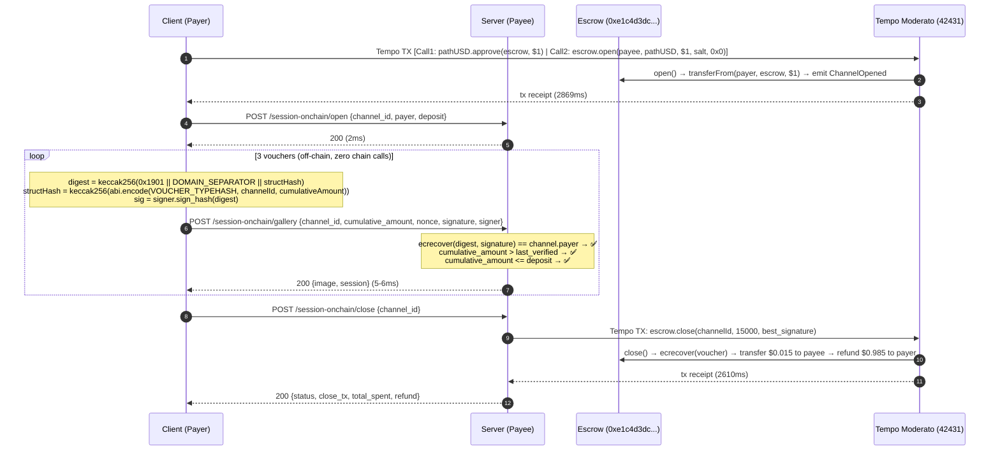
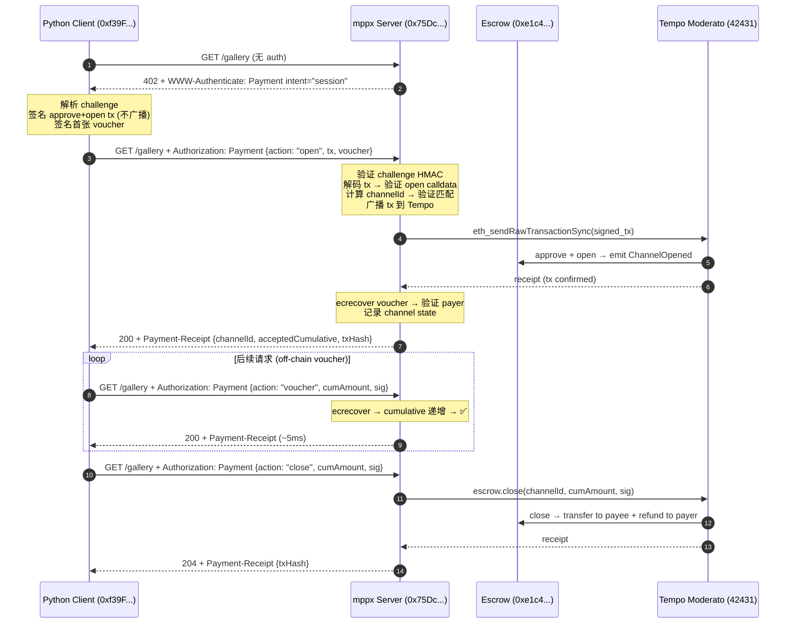

# MPP Python Demo — E2E 详细过程报告

- **运行时间**：2026-03-27T02:19:00Z (E2E 1-3) / 2026-03-31T04:44:00Z (E2E 4)
- **平台**：Ubuntu 24.04 LTS, Python 3.14.3
- **pympp**: 0.4.2 (E2E 1-3) / 0.5.0 (E2E 4) | **pytempo**: 0.4.0 | **mppx**: 0.5.0 (E2E 4)
- **链**：Tempo Moderato Testnet (chain ID 42431)
- **Token**: pathUSD (`0x20c0000000000000000000000000000000000000`, decimals=6)
- **Escrow 合约**: `0xe1c4d3dce17bc111181ddf716f75bae49e61a336` (TempoStreamChannel)
- **单元测试**: 56 passed

---

## 测试账户

| 角色 | Address | 用途 |
|------|---------|------|
| Payer (Client) | `0x76BFc4B290823a08c6402fBC444A8E99B57d8a3D` | 付款方，签 voucher，链上 open |
| Payee (Server) | `0x5d8D22169d5759E7edDF32898138368D7dfd7d9f` | 收款方，验 voucher，链上 close |
| Funded via | `tempo_fundAddress` RPC faucet | pathUSD testnet 代币 |

**Signer 类型**: `LocalSigner`（async `sign_hash`）→ `SignerTempoMethod`（override pympp 内部签名）

---

## E2E 1: Charge — 官方 mpp.dev/api/ping/paid

端到端耗时：**1922 ms**（首跳 202ms + 二跳 1720ms）

### 1.1 时序图



### 1.2 首跳：获取 Challenge

- **Method**: `GET`
- **URL**: `https://mpp.dev/api/ping/paid`
- **响应状态**: `402 Payment Required`
- **耗时**: 202 ms

**响应 Headers**:
```http
HTTP/2 402
cache-control: no-store
content-type: application/problem+json
www-authenticate: Payment id="oek3wtgk71iy19JDrKi_w3sQvHZv7KcyoVmuVqdCXo8",
  realm="mpp.sh", method="tempo", intent="charge",
  request="eyJhbW91bnQiOiIxMDAwMDAi...",
  description="Ping endpoint access",
  expires="2026-03-27T02:24:07.636Z"
```

**Body (RFC 9457 Problem Details)**:
```json
{
  "type": "https://paymentauth.org/problems/payment-required",
  "title": "Payment Required",
  "status": 402,
  "detail": "Payment is required (Ping endpoint access).",
  "challengeId": "oek3wtgk71iy19JDrKi_w3sQvHZv7KcyoVmuVqdCXo8"
}
```

**Challenge `request` 解码** (base64url → JSON):
```json
{
  "amount": "100000",
  "currency": "0x20c0000000000000000000000000000000000000",
  "methodDetails": {
    "chainId": 42431,
    "feePayer": true
  },
  "recipient": "0xf39Fd6e51aad88F6F4ce6aB8827279cffFb92266"
}
```

**关键字段解释**:
| 字段 | 值 | 含义 |
|------|------|------|
| `id` | `oek3wtgk...` | HMAC-SHA256 challenge ID（服务端无状态验证） |
| `realm` | `mpp.sh` | 服务端标识 |
| `method` | `tempo` | Tempo 支付方式 |
| `intent` | `charge` | 一次性支付 |
| `amount` | `100000` | 0.10 pathUSD（6 decimals） |
| `currency` | `0x20c0...` | pathUSD 合约地址 |
| `chainId` | `42431` | Tempo Moderato Testnet |
| `feePayer` | `true` | 服务端赞助 gas |
| `recipient` | `0xf39F...` | Tempo 官方收款地址 |
| `expires` | `2026-03-27T02:24:07.636Z` | 5 分钟有效期 |

### 1.3 从 Challenge 构造待签名交易

`SignerTempoMethod._build_with_signer()` 执行：

**Step 1: 获取链上参数** (RPC: `https://rpc.moderato.tempo.xyz`)
```python
chain_id, nonce, gas_price = await get_tx_params(rpc_url, signer.address)
# → (42431, on_chain_nonce, current_gas_price)
```

**Step 2: 构造 TIP-20 transferWithMemo calldata**
```
Selector: 0x95777d59 = keccak256("transferWithMemo(address,uint256,bytes32)")[:4]
Parameters:
  to:     0xf39Fd6e51aad88F6F4ce6aB8827279cffFb92266  (recipient)
  amount: 100000                                        (0.10 pathUSD)
  memo:   attribution_hash                              (server_id + client_id)
```

**Step 3: 构造 TempoTransaction** (feePayer 模式)
```python
tx = TempoTransaction.create(
    chain_id=42431,
    gas_limit=1000000,
    max_fee_per_gas=gas_price,
    max_priority_fee_per_gas=gas_price,
    nonce=0,                     # expiring nonce
    nonce_key=2**256 - 1,        # U256::MAX (expiring nonce key)
    fee_token=None,              # feePayer 模式下由服务端设定
    awaiting_fee_payer=True,
    valid_before=now + 25,       # 25 秒有效窗口
    calls=(Call(to=pathUSD, value=0, data=transfer_calldata),),
)
```

**Step 4: 获取 signing hash**
```python
signing_hash = tx.get_signing_hash(for_fee_payer=False)
# = keccak256(0x76 || RLP([chainId, maxPriorityFee, maxFee, gasLimit,
#   calls, accessList, nonceKey, nonce, validBefore, validAfter,
#   b"", 0x00, tempoAuthList]))
# → 32 bytes
```

**Step 5: Signer 签名** ⭐
```python
sig_bytes = await signer.sign_hash(signing_hash)
# LocalSigner: Account.unsafe_sign_hash(hash)
# → 65 bytes (r(32) + s(32) + v(1))
```

**Step 6: 构造 fee payer envelope**
```python
sig = Signature.from_bytes(sig_bytes)
signed_tx = attrs.evolve(tx, sender_signature=sig, sender_address=signer.address)
envelope = encode_fee_payer_envelope(signed_tx)
# → 0x78 prefix + RLP([tx_fields, sender_address, sender_signature])
```

### 1.4 二跳：提交 Credential

pympp `Client` 封装为 `Credential`:
```python
Credential(
    challenge=challenge.to_echo(),   # 回显 challenge 参数（含 HMAC ID）
    payload={
        "type": "transaction",
        "signature": "0x78..."       # fee payer envelope hex
    },
    source="did:pkh:eip155:42431:0x76BFc4B290823a08c6402fBC444A8E99B57d8a3D"
)
```

序列化为 `Authorization: Payment ...` header，重试请求。

**服务端验证流程**:
1. 解析 `Authorization` header → `Credential`
2. 验证 challenge echo 的 HMAC（无状态验证 challenge 完整性）
3. 解码 fee payer envelope → ecrecover 恢复 sender 地址
4. 设定 fee_token → co-sign as fee payer → 广播到 Tempo Moderato
5. 轮询 receipt → 验证 Transfer log

### 1.5 结算结果

- **响应状态**: `200`
- **耗时**: 1720 ms
- **Body**: `tm! thanks for paying`

**Payment-Receipt 解码**:
```json
{
  "method": "tempo",
  "status": "success",
  "timestamp": "2026-03-27T02:21:49.345Z",
  "reference": "0x7e6b0a21c3282a812a31c96edcb8082ea02184c80ef9ad4d5d1552861d0f2279"
}
```

**链上核验**:
- **txHash**: `0x7e6b0a21c3282a812a31c96edcb8082ea02184c80ef9ad4d5d1552861d0f2279`
- **Explorer**: <https://explore.testnet.tempo.xyz/tx/0x7e6b0a21c3282a812a31c96edcb8082ea02184c80ef9ad4d5d1552861d0f2279>
- **实际转账**: 0.10 pathUSD from `0x76BFc4B2...` → `0xf39Fd6e5...`

---

## E2E 2: Charge — 本地 Server /joke

端到端耗时：**1826 ms**（首跳 3ms + 二跳 1823ms）

### 2.1 首跳：获取 Challenge

- **URL**: `http://localhost:8801/joke`
- **响应状态**: `402`
- **耗时**: 3 ms

```
WWW-Authenticate: Payment id="MxaJ3VOpdo2UjJ83bp5Ff0SiEu_49hg_JcYtRuuf2FM",
  realm="localhost", method="tempo", intent="charge",
  request="...", description="One programmer joke ($0.01)",
  expires="..."
```

**Challenge request 解码**:
```json
{
  "amount": "10000",
  "currency": "0x20c0000000000000000000000000000000000000",
  "methodDetails": { "chainId": 42431 },
  "recipient": "0x5d8D22169d5759E7edDF32898138368D7dfd7d9f"
}
```

- `amount`: 10000 = **$0.01 pathUSD**
- **无 feePayer** → Client 自付 gas
- `fee_token` 设为 pathUSD（用稳定币付 gas）

### 2.2 签名差异（vs E2E 1）

| 维度 | E2E 1 (mpp.dev) | E2E 2 (local) |
|------|-----------------|---------------|
| feePayer | `true` (服务端赞助 gas) | `false` (Client 自付) |
| nonce_key | `2^256 - 1` (expiring) | `0` (normal sequential) |
| nonce | `0` (expiring) | 链上实际 nonce |
| fee_token | `None` (server 设定) | pathUSD |
| 输出格式 | fee payer envelope (0x78) | signed tx (0x76) |
| Server 验证 | fee payer co-sign + broadcast | 直接 `eth_sendRawTransaction` |

### 2.3 结算结果

```
Status: 200 (1823ms)
Joke: Debugging: removing bugs. Programming: adding them.
Payer: did:pkh:eip155:42431:0x76BFc4B290823a08c6402fBC444A8E99B57d8a3D
```

**Receipt**:
```json
{
  "method": "tempo",
  "reference": "0xe4a161f24211960c8ee8a2705343e0ba78907fcc88ad992f34e35e042f0ac615",
  "status": "success",
  "timestamp": "2026-03-27T02:21:51.216036Z"
}
```

**Explorer**: <https://explore.testnet.tempo.xyz/tx/0xe4a161f24211960c8ee8a2705343e0ba78907fcc88ad992f34e35e042f0ac615>

---

## E2E 3: Session On-chain — 真实 TempoStreamChannel Escrow

端到端耗时：**~8.5s** (open 2869ms + register 2ms + 3 vouchers 16ms + close 2610ms)
链上交易：**2 笔**（open + close）| Off-chain 验证：**3 次** (ecrecover, ~5ms each)

### 3.1 时序图



### 3.2 Step 1: 获取 Server 信息

```
GET /session-onchain/info → 200
```
```json
{
  "payee": "0x5d8D22169d5759E7edDF32898138368D7dfd7d9f",
  "escrow": "0xe1c4d3dce17bc111181ddf716f75bae49e61a336",
  "price_per_image": 5000,
  "default_deposit": 1000000
}
```

### 3.3 Step 2: 链上 Open (approve + open batched)

**Tempo Transaction** (type 0x76, 2 calls batched in 1 tx):

```
Call 1: pathUSD.approve(escrow, 1000000)
  to:       0x20c0000000000000000000000000000000000000 (pathUSD)
  selector: 0x095ea7b3 = approve(address,uint256)
  args:     escrow_address(32B) + amount(32B)

Call 2: escrow.open(payee, token, deposit, salt, authorizedSigner)
  to:       0xe1c4d3dce17bc111181ddf716f75bae49e61a336 (escrow)
  selector: 0xc79ea485 = open(address,address,uint128,bytes32,address)
  args:     payee(32B) + token(32B) + deposit(32B) + salt(32B) + 0x0(32B)
```

**Salt**: `0xccfba8006112bdaef37adf274fc4d132e00be7e30a02c5eedafaea72f84035a6`

**签名流程**:
```python
tx = TempoTransaction.create(
    chain_id=42431,
    gas_limit=2000000,           # 1M per call × 2 calls
    fee_token=PATH_USD_ADDRESS,  # 用 pathUSD 付 gas
    calls=(approve_call, open_call),
    ...
)
signing_hash = tx.get_signing_hash(for_fee_payer=False)
sig_bytes = await signer.sign_hash(signing_hash)    # ⭐ LocalSigner
signed_tx = attrs.evolve(tx, sender_signature=Signature.from_bytes(sig_bytes), ...)
raw_hex = "0x" + signed_tx.encode().hex()
tx_hash = await eth_sendRawTransaction(raw_hex)
```

**结果**:
- **TX**: `0x180631457f389dd6e02adff69a043ede35aa320fff61b0a4058fc8786669cbc0`
- **Channel ID**: `0xce21255bd407318a6b4a5f20b420460f41dc83162cda4a01b21ba1e6e8dfba8d`
- **耗时**: 2869ms
- **Explorer**: <https://explore.testnet.tempo.xyz/tx/0x180631457f389dd6e02adff69a043ede35aa320fff61b0a4058fc8786669cbc0>

**Digest 验证**（确认我们的 EIP-712 与合约一致）:
```
Contract getVoucherDigest(channelId, 5000): 0xe6344ed5a6a375cd...
Local compute_voucher_digest(channelId, 5000): 0xe6344ed5a6a375cd...
Match: ✅
```

### 3.4 Step 3: 注册 Channel

```
POST /session-onchain/open → 200 (2ms)
```
Server 记录 channel_id/payer/deposit 用于后续 voucher 验证。

### 3.5 Step 4: Off-chain Voucher 签名与验证

**EIP-712 常量** (与合约完全一致):

```
VOUCHER_TYPEHASH: 0xe97c93f01d3ef8eaba1586553df13308f236815bf4ea49c7b696895d8f5ea68a
  = keccak256("Voucher(bytes32 channelId,uint128 cumulativeAmount)")

DOMAIN_SEPARATOR: 0x3271aa2ef112b8493e889b17f852ad8e0a0b30565a62f3c066aa9fb0b7444e0c
  = keccak256(abi.encode(
      EIP712Domain_typehash,
      keccak256("Tempo Stream Channel"),
      keccak256("1"),
      42431,
      0xe1c4d3dce17bc111181ddf716f75bae49e61a336
  ))
```

**Digest 计算** (`compute_voucher_digest()`):
```python
struct_hash = keccak256(abi.encode(VOUCHER_TYPEHASH, channelId, cumulativeAmount))
digest = keccak256(b"\x19\x01" + DOMAIN_SEPARATOR + struct_hash)
sig_bytes = await signer.sign_hash(digest)  # 65 bytes
```

**3 个 Voucher 的完整数据**:

| # | cumulativeAmount | Digest (前 16 hex) | Signature | Server 验证耗时 |
|---|-----------------|-------------------|-----------|------------|
| 1 | 5000 ($0.005) | `e6344ed5a6a375cd` | `0xcf6332aeb1e0820c...aec8211c` | 6ms |
| 2 | 10000 ($0.010) | `482cfb341309a22f` | `0x2d6a51fb3e6e3a67...1277e81b` | 5ms |
| 3 | 15000 ($0.015) | `330b07f4592b6c8d` | `0x96d4b14b2652dda9...95b4111c` | 5ms |

**Server 验证流程** (每次 ~5ms, 纯 CPU):
1. `channel = channels[voucher.channel_id]` → 存在 ✅
2. `voucher.nonce > channel.last_nonce` → 递增 ✅
3. `voucher.cumulative_amount > channel.cumulative_verified` → 递增 ✅
4. `voucher.cumulative_amount <= channel.deposit` → 未超限 ✅
5. `digest = compute_voucher_digest(channelId, cumulativeAmount)` → 32 bytes
6. `recovered = Account._recover_hash(digest, signature)` → ecrecover
7. `recovered == channel.payer` → 签名匹配 ✅
8. 更新 `cumulative_verified`, `last_nonce`, `best_signature`

### 3.6 Step 5: 链上 Close

Server 提交 **最高累积 voucher** (cumulativeAmount=15000, best_signature) 给 escrow 合约。

**Tempo Transaction**:
```
escrow.close(channelId, 15000, signature)
  selector: close(bytes32,uint128,bytes)
```

**合约内部执行**:
1. `msg.sender == channel.payee` → `0x5d8D22...` ✅
2. `cumulativeAmount > channel.settled` → 15000 > 0 ✅
3. `cumulativeAmount <= channel.deposit` → 15000 ≤ 1000000 ✅
4. `structHash = keccak256(abi.encode(VOUCHER_TYPEHASH, channelId, 15000))`
5. `digest = _hashTypedData(structHash)` → EIP-712 digest
6. `signer = ECDSA.recoverCalldata(digest, signature)` → ecrecover
7. `signer == channel.payer` → `0x76BFc4B2...` ✅
8. `delta = 15000 - 0 = 15000` → transfer 15000 pathUSD to payee
9. `refund = 1000000 - 15000 = 985000` → transfer 985000 pathUSD to payer
10. `emit ChannelClosed(...)`

**结果**:
```json
{
  "status": "closed_onchain",
  "channel_id": "0xce21255bd407318a6b4a5f20b420460f41dc83162cda4a01b21ba1e6e8dfba8d",
  "total_spent": 15000,
  "refund": 985000,
  "payer": "0x76BFc4B290823a08c6402fBC444A8E99B57d8a3D",
  "best_signature": "0x96d4b14b2652dda953e79780f9684153eb5c4a6727c5da894b49a95a25e82c2e3d7a053abe9b065a75e229437b0d36555aa07c85de3575b4c376ef371395b4111c",
  "tx_hash": "0x0347003621f67baa7d8e42e1dd94bbe3609e008e6caba2999a486dfb5b59ad8a"
}
```

- `total_spent`: 15000 = **$0.015** (3 images × $0.005)
- `refund`: 985000 = **$0.985** ($1.000 - $0.015)
- **Close TX**: <https://explore.testnet.tempo.xyz/tx/0x0347003621f67baa7d8e42e1dd94bbe3609e008e6caba2999a486dfb5b59ad8a>
- **Open TX**: <https://explore.testnet.tempo.xyz/tx/0x180631457f389dd6e02adff69a043ede35aa320fff61b0a4058fc8786669cbc0>

---

## 性能对比

| 维度 | Charge (E2E 1/2) | Session REST (E2E 3) | Session HTTP 402 (E2E 4) |
|------|-------------------|---------------------|--------------------------|
| 单次请求延迟 | ~1700-1800 ms | **5-6 ms** (voucher) | **5 ms** (voucher) |
| 首次请求延迟 | ~1800 ms | 2869 ms (client broadcast) | 954 ms (server broadcast) |
| 链上交易 | 每次 1 笔 | 2 笔 (open + close) | 2 笔 (open + close) |
| 3 requests 总耗时 | ~5.4s (3 × 1.8s) | **16ms** (3 × ~5ms) | **10ms** (2 × 5ms + open) |
| 含 open/close 总耗时 | — | ~8.5s | ~1.3s |
| 验证方式 | 链上 receipt + Transfer log | ecrecover (CPU-bound) | ecrecover + HMAC (CPU-bound) |
| Gas per request | ~270K each | **0** (仅 open/close) | **0** (仅 open/close) |
| Tx 广播方 | Client | Client | **Server** |
| 标准化 | IETF Payment Auth | 自定义 REST | IETF Payment Auth |
| 跨语言兼容 | pympp/mppx | 否 | **是 (mppx 标准)** |
| 适用场景 | 单次购买 | 高频 API (demo) | **高频 API (production)** |

### Benchmark (100 vouchers)
```
Sign:   2.5 ms/voucher
Verify: 3.7 ms/voucher
Total:  6.2 ms/round-trip
```

---

## E2E 4: Session HTTP — 真实 402 协议流程 (Python Client ↔ mppx JS Server)

- **运行时间**: 2026-03-31T04:44:00Z
- **Server**: mppx 0.5.0 (TypeScript, Bun 1.3.11) — `server-js/`
- **Client**: Python 3.14.3 + `SessionHttpClient`
- **pympp**: 0.5.0 | **pytempo**: 0.4.0
- **feePayer**: `false`（Client 自付 gas）

端到端耗时：**~1.3s**（402 7ms + open sign 262ms + open broadcast 954ms + 2 vouchers 10ms + close 301ms）
链上交易：**2 笔**（server broadcast open + server settle close）
Off-chain 验证：**2 次**（voucher ecrecover, ~5ms each）

### 4.1 时序图



### 4.2 测试账户

| 角色 | Address | 来源 |
|------|---------|------|
| Client (Payer) | `0xf39Fd6e51aad88F6F4ce6aB8827279cffFb92266` | Hardhat 默认 key, faucet 充值 |
| Server (Payee) | `0x75Dc3bA620Fc55F7aEBE67a88d729dAcA46c8935` | mppx server 启动时生成, faucet 充值 |

### 4.3 Step 1: 初始请求 → 402

- **URL**: `GET http://localhost:5555/gallery`
- **响应状态**: `402 Payment Required`
- **Content-Type**: `application/problem+json`
- **耗时**: 7ms

**WWW-Authenticate Header**:
```http
Payment id="uT8ioaQIIXYtJ-U8evqgbkclA-RRUfVVjKSAswI5VIQ",
  realm="localhost",
  method="tempo",
  intent="session",
  request="eyJhbW91bnQiOiI1MDAwIiwiY3VycmVuY3kiOiIweDIwYzAw...",
  expires="2026-03-31T04:49:13.173Z"
```

**Challenge `request` 解码** (base64url → JSON):
```json
{
  "amount": "5000",
  "currency": "0x20c0000000000000000000000000000000000000",
  "methodDetails": {
    "chainId": 42431,
    "escrowContract": "0xe1c4d3dce17bc111181ddf716f75bae49e61a336"
  },
  "recipient": "0x75Dc3bA620Fc55F7aEBE67a88d729dAcA46c8935",
  "unitType": "image"
}
```

**402 Body** (RFC 9457 Problem Details):
```json
{
  "type": "https://paymentauth.org/problems/payment-required",
  "title": "Payment Required",
  "status": 402,
  "detail": "Payment is required.",
  "challengeId": "uT8ioaQIIXYtJ-U8evqgbkclA-RRUfVVjKSAswI5VIQ"
}
```

**关键字段解释**:
| 字段 | 值 | 含义 |
|------|------|------|
| `id` | `uT8ioaQII...` | HMAC-SHA256(secretKey, realm\|method\|intent\|request\|expires\|\|) — 无状态验证 |
| `intent` | `session` | 付费通道模式（vs `charge` 单次付费） |
| `amount` | `5000` | $0.005 pathUSD / 请求 |
| `escrowContract` | `0xe1c4d3dc...` | TempoStreamChannel 合约 |
| `unitType` | `image` | 计费单位标识 |
| `expires` | `2026-03-31T04:49:13.173Z` | Challenge 有效期 5 分钟 |

**vs E2E 3 (REST session) 的差异**:
| 维度 | E2E 3 (REST session) | E2E 4 (HTTP 402 session) |
|------|---------------------|--------------------------|
| 发现方式 | `GET /session-onchain/info` | `402 + WWW-Authenticate` |
| 参数来源 | 手动拼接 | Challenge 自动携带 |
| HMAC 验证 | 无 | 有（无状态 challenge ID） |
| 标准化 | 自定义 REST | IETF Payment Authentication Scheme |

### 4.4 Step 2: 签名 approve+open 交易（不广播）

Python client 构造 Tempo Transaction (type 0x76)，**签名但不广播** — server 负责广播。

```python
raw_tx, channel_id = await escrow.sign_approve_and_open(
    payee="0x75Dc3bA620Fc55F7aEBE67a88d729dAcA46c8935",
    deposit=1_000_000,
    salt=bytes.fromhex("97d4e5c342dd16e8f1fa09b8c8e521c898bfc12bec1aa87382b0a2cafd3501f7"),
)
```

**交易内容** (type 0x76, 2 calls batched):
```
Call 1: pathUSD.approve(escrow, 1000000)
  to:       0x20c0000000000000000000000000000000000000 (pathUSD)
  selector: 0x095ea7b3 = approve(address,uint256)

Call 2: escrow.open(payee, token, deposit, salt, authorizedSigner)
  to:       0xe1c4d3dce17bc111181ddf716f75bae49e61a336 (escrow)
  selector: 0xc79ea485 = open(address,address,uint128,bytes32,address)
```

- **Salt**: `0x97d4e5c342dd16e8f1fa09b8c8e521c898bfc12bec1aa87382b0a2cafd3501f7`
- **Channel ID**: `0x8f2ee76e9772344189c712b2a66c3202f03a5f71eb61d5fef8788eca48fd4895`
  - = `keccak256(abi.encode(payer, payee, token, salt, authorizedSigner, escrowContract, chainId))`
- **Raw TX**: 816 chars, prefix `0x76f90193...`
- **签名耗时**: 262ms（含 RPC 获取 nonce/gas）

### 4.5 Step 3: 构造 Open Credential

```python
credential = {
    "challenge": {
        "id": "uT8ioaQIIXYtJ-U8evqgbkclA-RRUfVVjKSAswI5VIQ",
        "realm": "localhost",
        "method": "tempo",
        "intent": "session",
        "request": "eyJhbW91bnQiOiI1MDAwIi...",   # 原样回显
        "expires": "2026-03-31T04:49:13.173Z"      # 必须包含（参与 HMAC）
    },
    "payload": {
        "action": "open",
        "type": "transaction",
        "channelId": "0x8f2ee76e9772344189c712b2a66c3202f03a5f71eb61d5fef8788eca48fd4895",
        "transaction": "0x76f90193...",              # 签名原始 tx（非 tx hash！）
        "signature": "0x43a10d5e1ec9c5ead9...1b",   # 首张 voucher 签名
        "cumulativeAmount": "5000"                   # 首次金额
    },
    "source": "did:pkh:eip155:42431:0xf39Fd6e51aad88F6F4ce6aB8827279cffFb92266"
}
```
→ base64url 编码 → `Authorization: Payment <encoded>` (2288 chars)

**首张 Voucher EIP-712 签名**:
```
digest = keccak256(0x1901 || DOMAIN_SEPARATOR || structHash)
structHash = keccak256(abi.encode(VOUCHER_TYPEHASH, channelId, 5000))
digest = 0x11dd673de1a6ef81520bc99bbf784cc7...
signature = 0x43a10d5e1ec9c5ead9...4491ae1b
```

### 4.6 Step 4: Server 处理 Open Credential

mppx server (`broadcastOpenTransaction`) 执行：

1. **HMAC 验证**: 重算 `HMAC-SHA256(secretKey, realm|method|intent|request|expires||)` → 比对 challenge.id ✅
2. **解码 tx**: `Transaction.deserialize("0x76f90193...")` → 提取 calls
3. **验证 open call**: 找到 `escrow.open()` calldata → 解码参数
4. **验证 payee/token**: open 的 payee == challenge.recipient ✅, token == currency ✅
5. **计算 channelId**: `Channel.computeId({payer, payee, token, salt, ...})` → 比对 credential.channelId ✅
6. **广播 tx**: `eth_sendRawTransactionSync("0x76f90193...")` → 链上确认
7. **验证 voucher**: ecrecover(digest, signature) == payer ✅
8. **记录 channel state**: `{channelId, deposit, payer, acceptedCumulative: 5000}`

**结果**:
- **状态**: 200
- **耗时**: 954ms（含链上 open 广播+确认）
- **Open TX**: `0x69ace97bcd3d91ae30baf7f78ab0b3934cd63c03a3b757cc03e1577701543dc6`
- **Explorer**: <https://explore.testnet.tempo.xyz/tx/0x69ace97bcd3d91ae30baf7f78ab0b3934cd63c03a3b757cc03e1577701543dc6>

**Payment-Receipt 解码**:
```json
{
  "method": "tempo",
  "intent": "session",
  "status": "success",
  "timestamp": "2026-03-31T04:44:14.392Z",
  "reference": "0x8f2ee76e977234418...",
  "challengeId": "uT8ioaQIIXYtJ-U8evqgbkclA-RRUfVVjKSAswI5VIQ",
  "channelId": "0x8f2ee76e977234418...",
  "acceptedCumulative": "5000",
  "spent": "0",
  "units": 0,
  "txHash": "0x69ace97bcd3d91ae30baf7f78ab0b3934cd63c03a3b757cc03e1577701543dc6"
}
```

### 4.7 Step 5: Off-chain Voucher 请求

Channel 已建立后，后续请求只需 signed voucher — **零链上调用**。

**Voucher 详细数据**:

| # | cumulativeAmount | Digest (前 32 hex) | Signature | 耗时 | 结果 |
|---|-----------------|-------------------|-----------|------|------|
| 1 | 5000 ($0.005) | `0x11dd673de1a6ef81520bc99bbf784cc7` | `0x43a10d5e...4491ae1b` | 954ms (含 open) | Forest Path |
| 2 | 10000 ($0.010) | `0xa18168d571e9642e8de2b97b23af997d` | `0x408ab77a...a7d23a1b` | 5ms | Mountain Dawn |
| 3 | 15000 ($0.015) | `0x527586cb81ea2b55029590ccda87acec` | `0xa45ac5d9...33c5821c` | 5ms | Ocean Breeze |

**Voucher Credential 格式** (action: "voucher"):
```json
{
    "challenge": { "id": "...", "realm": "localhost", ... },
    "payload": {
        "action": "voucher",
        "channelId": "0x8f2ee76e977234418...",
        "cumulativeAmount": "10000",
        "signature": "0x408ab77accf1a227b8...a7d23a1b"
    },
    "source": "did:pkh:eip155:42431:0xf39F..."
}
```

**Server 验证** (mppx `handleVoucher`, ~5ms):
1. `channelStore.get(channelId)` → 存在 ✅
2. `verifyVoucher(escrowContract, chainId, voucher, expectedSigner)`:
   - `recoverTypedDataAddress({domain, types, message, signature})` → ecrecover
   - `recovered == channel.payer` → ✅
3. `cumulativeAmount > channel.acceptedCumulative` → 递增 ✅
4. `cumulativeAmount <= channel.deposit` → 未超限 ✅
5. 更新 `acceptedCumulative`, 返回 receipt

### 4.8 Step 6: Close Channel

Python client 发送 `action: "close"` credential，mppx server 链上结算。

**Close Credential**:
```json
{
    "payload": {
        "action": "close",
        "channelId": "0x8f2ee76e977234418...",
        "cumulativeAmount": "15000",
        "signature": "0xa45ac5d9f1028ca460...33c5821c"
    }
}
```

**Server 处理** (mppx `handleClose`):
1. 验证 voucher 签名
2. 调用 `closeOnChain(client, escrowContract, channelId, cumulativeAmount, signature)`
3. Escrow 合约:
   - ecrecover → payer ✅
   - transfer 15000 to payee
   - refund 985000 to payer
   - emit `ChannelClosed`

**结果**:
- **状态**: 204
- **耗时**: 301ms
- **Settle TX**: `0xf546e9ec5d770c36cdea65254b644d86e8448a5c5aa4c6e0e8d31712c5b95671`
- **Explorer**: <https://explore.testnet.tempo.xyz/tx/0xf546e9ec5d770c36cdea65254b644d86e8448a5c5aa4c6e0e8d31712c5b95671>

**Close Receipt**:
```json
{
  "method": "tempo",
  "intent": "session",
  "status": "success",
  "channelId": "0x8f2ee76e977234418...",
  "acceptedCumulative": "15000",
  "txHash": "0xf546e9ec5d770c36cdea65254b644d86e8448a5c5aa4c6e0e8d31712c5b95671"
}
```

### 4.9 结算汇总

| 项目 | 值 |
|------|------|
| Channel ID | `0x8f2ee76e9772344189c712b2a66c3202f03a5f71eb61d5fef8788eca48fd4895` |
| Deposit | 1,000,000 ($1.00) |
| Total spent | 15,000 ($0.015) |
| Refund | 985,000 ($0.985) |
| Images purchased | 3 |
| Price per image | 5,000 ($0.005) |
| Open TX | <https://explore.testnet.tempo.xyz/tx/0x69ace97bcd3d91ae30baf7f78ab0b3934cd63c03a3b757cc03e1577701543dc6> |
| Settle TX | <https://explore.testnet.tempo.xyz/tx/0xf546e9ec5d770c36cdea65254b644d86e8448a5c5aa4c6e0e8d31712c5b95671> |

---

## E2E 3 vs E2E 4 对比

| 维度 | E2E 3 (REST Session) | E2E 4 (HTTP 402 Session) |
|------|---------------------|--------------------------|
| Server | Python (FastAPI) | TypeScript (mppx + Bun) |
| 协议标准 | 自定义 REST API | IETF Payment Authentication Scheme |
| 发现端点 | `GET /session-onchain/info` | 自动从 402 Challenge 获取 |
| Open | Client 广播 + `POST /open` 注册 | Client 签名 → Server 广播 |
| Voucher | `POST /gallery` + JSON body | `GET /gallery` + `Authorization` header |
| Close | `POST /close` | `GET /gallery` + `action: "close"` credential |
| Challenge HMAC | 无 | 有（无状态验证） |
| Receipt | JSON response body | `Payment-Receipt` header (base64url) |
| 首次请求延迟 | 2869ms (client broadcast) | 954ms (server broadcast) |
| 后续请求延迟 | 5-6ms | 5ms |
| 跨语言兼容 | 否（自定义格式） | 是（mppx 标准） |

---

## 安全属性

| 属性 | Charge | Session (REST / HTTP 402) |
|------|--------|--------------------------|
| 防重放 | challenge HMAC + nonce | 累积金额递增 + challenge HMAC (402) |
| 身份验证 | 链上 from 地址 | ecrecover = payer (off-chain) + contract ecrecover (on-chain close) |
| 金额上限 | 单次 challenge 金额 | escrow deposit (链上锁定) |
| 时间限制 | challenge expires 5min | channel 生命周期 + 15min close grace period |
| 签名绑定 | EIP-712 (Tempo tx hash) | EIP-712 (escrow domainSeparator + VOUCHER_TYPEHASH) |
| 链上结算 | 每次请求 | close 时批量 1 笔 |
| 退款保障 | — | escrow 合约自动退 refund |
| 密钥隔离 | `Signer.sign_hash()` | 同一 `Signer.sign_hash()` |
| Challenge 完整性 | HMAC-SHA256 | HMAC-SHA256 (402 模式) |

---

## 执行环境

| 组件 | 版本/配置 |
|------|----------|
| Python | 3.14.3 |
| pympp | 0.5.0 (E2E 1-3: 0.4.2) |
| pytempo | 0.4.0 |
| FastAPI | 0.135.2 |
| eth-account | 0.13+ |
| eth-abi | 5.0+ |
| mppx | 0.5.0 (TypeScript SDK, E2E 4) |
| Bun | 1.3.11 (E2E 4 server runtime) |
| viem | 2.47.6 (E2E 4 server) |
| Chain | Tempo Moderato Testnet (42431) |
| Token | pathUSD (`0x20c0...`, 6 decimals) |
| Escrow | `0xe1c4d3dce17bc111181ddf716f75bae49e61a336` |
| RPC | `https://rpc.moderato.tempo.xyz` |
| Official server | mpp.dev (Vercel) |
| Python server | FastAPI + uvicorn (127.0.0.1:8801) |
| JS server | mppx + Bun (127.0.0.1:5555, E2E 4) |
| Unit tests | 56 passed (1.82s) |
